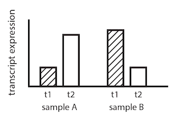

## Identification, annotation and visualisation of splicing switch events
When working with RNA-seq data, several tools exist to quantify differences in splicing across conditions and to address the significance of those changes (e.g. DEXSeq). Quiet often though, these tools result in a long list of genes that is difficult to interpret. By relying on transcript level quantifications, LOREM provides a simple (yet powerful) approach to identify, annotate and visualise the most extreme changes in splicing across two different conditions, namely switch events. In brief, switch events are defined as those cases where, for a given gene, the identity of the most abundant transcript changes across conditions:

Further information on LOREM can be found on the [project wiki](https://github.com/mgonzalezporta/lorem/wiki). Here we'll briefly explore an [example output report](http://www.ebi.ac.uk/~mar/tools/lorem/html_test1/).

***Exercise:*** How would you interpret the switch event identified for *SRSF6*?
[Hint](https://github.com/mgonzalezporta/lorem/wiki/Tutorial#interpreting-lorem-output)

